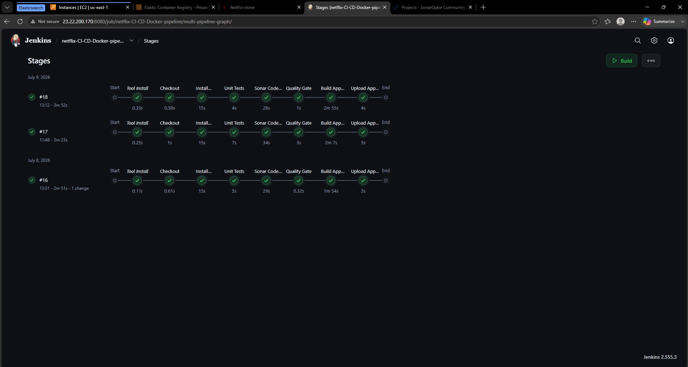

# Netflix Clone CI/CD Pipeline - Jenkins, SonarQube, Docker, ECR and ECS
A containerized CI/CD pipeline for a Netflix clone application, built with Jenkins, SonarQube, Docker, Amazon ECR, and AWS ECS (Fargate). This project is an extension of my earlier CI/CD pipeline, rebuilt to demonstrate containerization and cloud-native deployment.

## Overview

The previous CI/CD project used Jenkins, SonarQube, and Nexus on EC2, with the app served directly by an nginx server. This version keeps Jenkins and SonarQube as native installs for build orchestration and code quality analysis, but replaces the nginx deployment layer entirely with Docker, AWS ECR, and AWS ECS:

- The application is containerized with **Docker**
- Images are pushed to **Amazon ECR**
- The container is deployed and run via **AWS ECS (Fargate)**, behind an **Application Load Balancer**
  
## Architecture


## How it works

- Every time I push code to GitHub, Jenkins picks it up and runs it through a series of checks before anything gets built. First it runs unit tests, then sends the code to SonarQube for a code quality scan - SonarQube checks for bugs, and security issues, then sends its verdict back to Jenkins via a webhook. If the quality gate fails, the pipeline stops there; bad code never moves forward.

- Once the code passes, Jenkins builds a Docker image of the app, packaging the application and everything it needs to run into a single portable container, and pushes that image to Amazon ECR, AWS's private Docker image registry.

- From ECR, the image is deployed to AWS ECS running on Fargate, AWS's serverless container platform, there are no servers to manage here, just a running container. That container sits behind an Application Load Balancer, which gives the app a stable public URL and routes incoming traffic to it.

- Jenkins and SonarQube are the only two components running the traditional way, installed directly on EC2 instances. Everything from the image registry onward - ECR, ECS, and the load balancer - is fully managed by AWS. The entire setup lives inside a VPC, a private network boundary that keeps it isolated from the open internet by default.

- One deliberate design choice: Jenkins' pipeline stops once the image is published to ECR. I chose to deploy that image to ECS manually rather than automating it, so I could understand each step of the deployment process hands-on before automating it.

## How this mirrors real-world DevOps practice

This pipeline follows patterns used in actual engineering teams, not just a tutorial setup:

- **Separation of build and deploy** - many organizations intentionally split "build and publish an artifact" from "deploy it," often owned by different teams or requiring a manual approval step. This project reflects that same separation rather than collapsing everything into one automatic flow.
- **Quality gates before deployment** - code doesn't reach the build stage unless it passes both automated tests and a SonarQube quality gate, the same gatekeeping model used in production pipelines to stop bad code before it ships.
- **Immutable, versioned artifacts** - every build produces a uniquely tagged Docker image pushed to a registry, so any version can be traced back to the exact code and pipeline run that produced it.
- **Serverless container orchestration** - using ECS Fargate instead of managing EC2 servers directly mirrors the industry shift toward reducing infrastructure management overhead wherever possible.
  
## Pipeline Stages

1. **Fetch code** - checkout from GitHub
2. **Install Dependencies** - `npm install`
3. **Unit Tests** - `npm test`
4. **Sonar Code Analysis** - static analysis via SonarQube Scanner
5. **Quality Gate** - pipeline waits for SonarQube's pass/fail verdict via webhook
6. **Build App Image** - multi-stage Docker build (Node build stage → nginx serve stage), with the TMDB API key injected via build argument

## Local Development

```bash
git clone https://github.com/AnushaJoseph-00/netflix-clone-cicd-docker-ecr.git
cd netflix-clone-cicd-docker-ecr
npm install
npm start
```

Create a `.env` file based on `.env.example` with your own TMDB v3 API key:

## Building the Docker Image Locally

```bash
docker build --build-arg REACT_APP_TMDB_KEY=your_key_here -t netflix-clone:local .
docker run -p 8080:80 netflix-clone:local
```

Then visit `http://localhost:8080`.

   
## Screenshots

**AWS EC2 service running**


**Full pipeline run - all stages passing**


**SonarQube code quality analysis**


**Amazon ECR - versioned image builds**


**ECS service running and healthy**


**Live application**


## Next Steps / Future Improvements

- **Infrastructure as Code** - recreate the AWS infrastructure (EC2 instances, ECS cluster, ALB, security groups) using Terraform instead of manual console setup, enabling one-command provisioning and teardown
- **Kubernetes** - deploy the same containerized app to a Kubernetes cluster (EKS) as an alternative to ECS, for broader orchestration experience beyond AWS-specific tooling
- **Automated deployment triggers** - add a GitHub webhook so Jenkins builds automatically on every push, and reintroduce an automated ECS deployment stage to close the gap between CI and full CD
- **Monitoring and observability** - add Prometheus and Grafana to monitor the running ECS service, rather than relying on manually checking the AWS console
- **Secrets management** - move the TMDB API key and other secrets out of Jenkins credentials and Docker build arguments into AWS Secrets Manager, injected at runtime

## Related Project

- [Netflix-CI-CD-Pipeline](https://github.com/AnushaJoseph-00/Netflix-CI-CD-Pipeline) — the original native-install version of this pipeline (Jenkins, SonarQube, Nexus, nginx, all on EC2)
